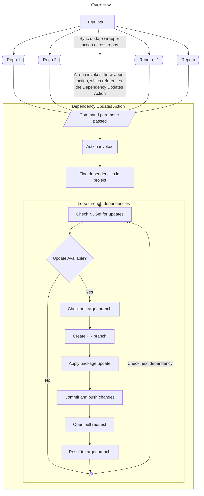

# dependency-updates-action
Handle .NET versioning concerns for Particular Software component packages

## How it works

```mermaid
---
title: Overview
---

flowchart TD
    repo-sync@{ shape: process }
    
    r1@{ shape: bow-rect, label: Repo 1 }
    r2@{ shape: bow-rect, label: Repo 2 }

    rellip@{ shape: text, label: ... }

    rn-1@{ shape: bow-rect, label: Repo n - 1 }
    rn@{ shape: bow-rect, label: Repo n }

    repo-sync --> r1
    repo-sync --> r2
    repo-sync -- "Sync update wrapper action across repos" --> rellip
    repo-sync --> rn-1
    repo-sync --> rn

    
    r1 --- input
    r2 --- input
    rellip -- "A repo invokes the wrapper action, which references the Dependency Updates Action" --- input
    rn-1 --- input
    rn --- input

    subgraph Dependency Updates Action

        input@{ shape: in-out, label: Command parameter passed }
        action-invoke@{ shape: event, label: Action invoked }
        find-deps@{ shape: process, label: Find dependencies in project }

        input --> action-invoke

        action-invoke --> find-deps --> check-dep

        subgraph Loop through dependencies

            check-dep@{ shape: process, label: Check NuGet for updates }
            has-update@{ shape: decision, label: Update Available? }
            checkout@{ shape: process, label: Checkout target branch }
            create-branch@{ shape: process, label: Create PR branch }
            reset-branch@{ shape: process, label: Reset to target branch }
            update@{ shape: process, label: Apply package update }
            commit@{ shape: process, label: Commit and push changes }
            open-pr@{ shape: process, label: Open pull request }
            dep-done@{ shape: stop }


            check-dep --> has-update
            has-update -- "No" --> dep-done
            has-update -- "Yes" --> checkout
            checkout --> create-branch --> update --> commit --> open-pr --> reset-branch
            reset-branch --> dep-done


            dep-done -- "Check next dependency" --> check-dep

        end

    end
```