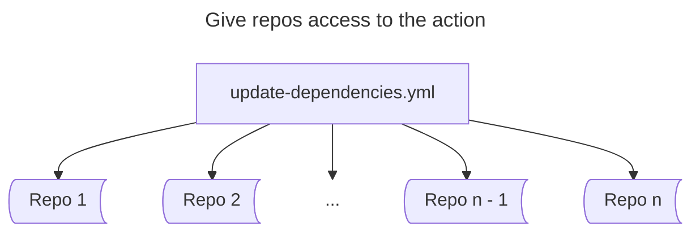
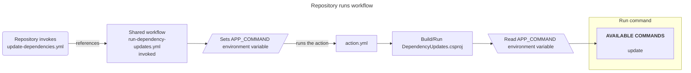
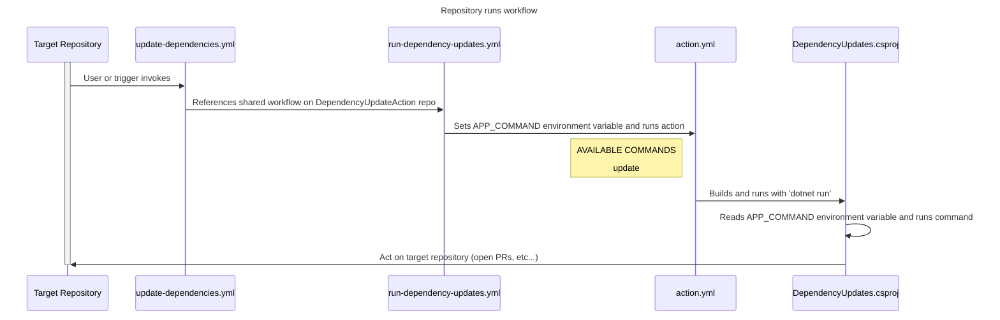

# dependency-updates-action
Handle .NET versioning concerns for Particular Software component packages

## How it works

A wrapper action, [update-dependencies.yml](https://github.com/Particular/DependencyUpdatesTest/blob/main/.github/workflows/update-dependencies.yml), is synced across repositories by [RepoStandards](https://github.com/Particular/RepoStandards). 

This allows any synced repo to invoke the [shared dependency updates workflow](https://github.com/Particular/dependency-updates-action/blob/main/.github/workflows/run-dependency-updates.yml).

